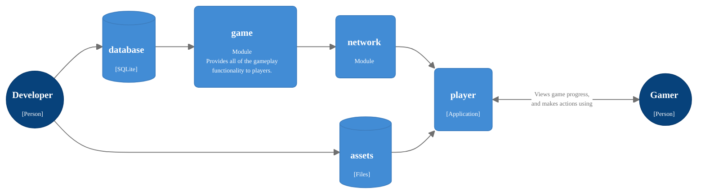

# Farmisto

```mermaid
%%{init: {'theme': 'base', 'themeVariables': {
  'primaryColor': '#428cd5',
  'primaryBorderColor': '#3d7ec0',
  'secondaryColor': 'white',
  'tertiaryColor': 'yellow',
  'lineColor': '#707070',
  'primaryTextColor': '#707070',
  'tertiaryTextColor': 'red',
  'textColor': '#707070',
  'background': 'white',
  'fontSize': '8px',
  'fontFamily': 'ui-monospace,SFMono-Regular,SF Mono,Menlo,Consolas,Liberation Mono,monospace'
  }}
}%%
flowchart LR;
	gamer(("<h2>&nbsp Gamer &nbsp</h2>[Person]")):::person
	developer(("<h2>Developer</h2>[Person]")):::person
	assets[(<h2>&nbsp assets  &nbsp</h2>&#91Files&#93)]:::component
	database[(<h2>database</h2>&#91SQLite&#93)]:::component
	game(<h2>game</h2>Module<br/>Provides all of the gameplay<br/> functionality to players.):::component
	network(<h2>network</h2>Module):::component
	player("<h2>player</h2>[Application]"):::component
	
	developer --> database;
	developer --> assets;
	
	database --> game;
	
	
	game-->network-->player;
		assets --> player;
	

	player <-- "Views game progress,<br/>and makes actions using" ---> gamer;

	classDef person fill:#07427b,stroke:#073b6f,color:white
	classDef component color:white
	classDef external fill:#999999,stroke:#707070
	
	click database "https://github.com/lebedec/farmisto/tree/main/database"
```