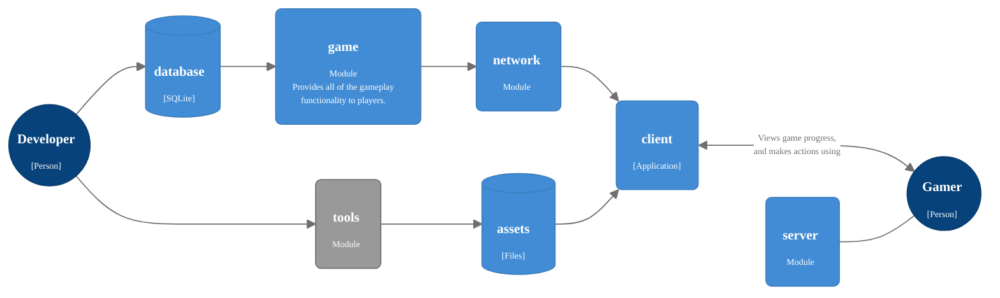

# Farmisto

## Design Principles

### Minimal Dependencies Count

The code should only contain the necessary pure Rust dependencies.
Especially if game development aspect relies on well known 3rd party solution,
then the pre-compiled shared binaries are an effective technique
to reduce compile-time dependencies and improve maintainability.

Here is table, showing dependencies reduction (about):

| Aspect       | Popular Solution | Alternative | Dependencies |
|--------------|------------------|-------------|--------------|
| Windowing    | winint           | rust-sdl2   | -81          |
| 3D Rendering | vulkano          | ash         | -32          |
| File Changes | notify           | OS Shell    | -20          | 