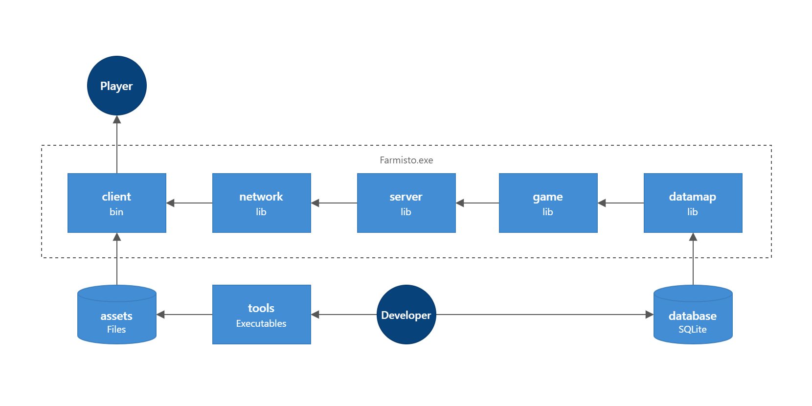

# Farmisto

Farmisto is a game about farming within are different planets of
the solar system. Use your imagination to design farm,
harvest crops, tend to animals, manage productions and finally
take on planet environment challenges.

## Project Overview

- [game](game)

  Module handles mechanics and gameplay in general.

- [ai](ai)

  AI is used to generate responsive, adaptive behaviors primarily in non-player entities like animals or drones. AI
  designed as separate process which acts like regular player via game API.

- [client](client)

  Game engine primarily designed
  for game development with "hot reload" experience for editing game scenes.
  Includes 2D rendering, sound, animation, networking, localization support.

- [database](database)

  Contains schemas which defines the structure and interrelations of data managed by SQLite database.

- [datamap](datamap)

  ORM library to map data in Rust objects and detect changes in data stored by SQLite.

- [assets](assets)

  Contains all game assets.

- [server](server)

  A thread that is responsible for the communication of players over the network and the execution of the main game
  cycle.

- [network](network)

  Small and simple network library based on TCP blocking sockets.

- [tools](tools)

  Suite supports the entirety of the game development process — external editors formats import and export,
  performance monitoring, instrumentation, AI configuration, scripting to customize the game creation scenarios, etc.

- [testing](testing)
  
  A dynamic Rust library contains FFI of game testing scenarios to be able to use it in any testing framework, in 
  other programming languages.

- [tests](tests)
  
  A game tests focuses on obtaining a clear understanding of desired game behavior through discussion with QA, 
  players or non-programmers participants. It implements BDD.
  

## Design Principles

### Database as Single Source of Data

One of the trickiest parts of developing games is managing data.
Using configuration files works well in many simple cases,
populating game object properties or pre-fabricating assets.

But if you want to combine datasets from a whole range of domains,
for example, to change a balance of game object properties
or build a context for editor mode the separated file reads turn out to be far more painful.
The bigger the game model gets, the more data becomes fragmented,
and the harder these challenges become.

Traditional SQL database help with this:

- Bringing together and manipulating datasets from different domains
- Guarantee that game data will be consistent
- Data format standardization, use of third-party tools

### Minimal Dependence

The code should only contain the necessary pure Rust dependencies.
Especially if game development aspect relies on well known 3rd party solution,
then the pre-compiled shared binaries are an effective technique
to reduce compile-time dependencies and improve maintainability.

Here is table, showing dependencies reduction (about):

| Aspect       | Popular Solution | Alternative | Dependencies |
|--------------|------------------|-------------|--------------|
| Windowing    | winint           | rust-sdl2   | ~80          |
| HTTP client  | reqwest          | ureq        | ~50          |
| 3D Rendering | vulkano          | ash         | ~30          |
| File Changes | notify           | OS Shell    | ~20          |

### Marcos as Lesser Evil

It is better to use the amazing features of Rust: traits, generics, const expressions.
There are only a few "legal" reasons to use macros:

- Data structure introspection to eliminate mapping code
- The variation of arguments to simplify non-game aspects, logging and stuff like that

## Development

### Windows

1. Download SDL development libraries from http://www.libsdl.org
2. Download FMOD development libraries from https://www.fmod.com
3. Install a Vulkan ready driver and SDK from https://www.lunarg.com/vulkan-sdk
4. Copy all development libraries to folder of your choosing:

   Current target build:
   > ./target/debug/deps

5. Run `client/src/main.rs`, specify env variables:
    - `RUST_LOG=info` for logging
    - `DEV_MODE=1` for dev mode
6. When you're shipping `client.exe` make sure to copy development libraries
   to the same directory that your compiled exe is in.