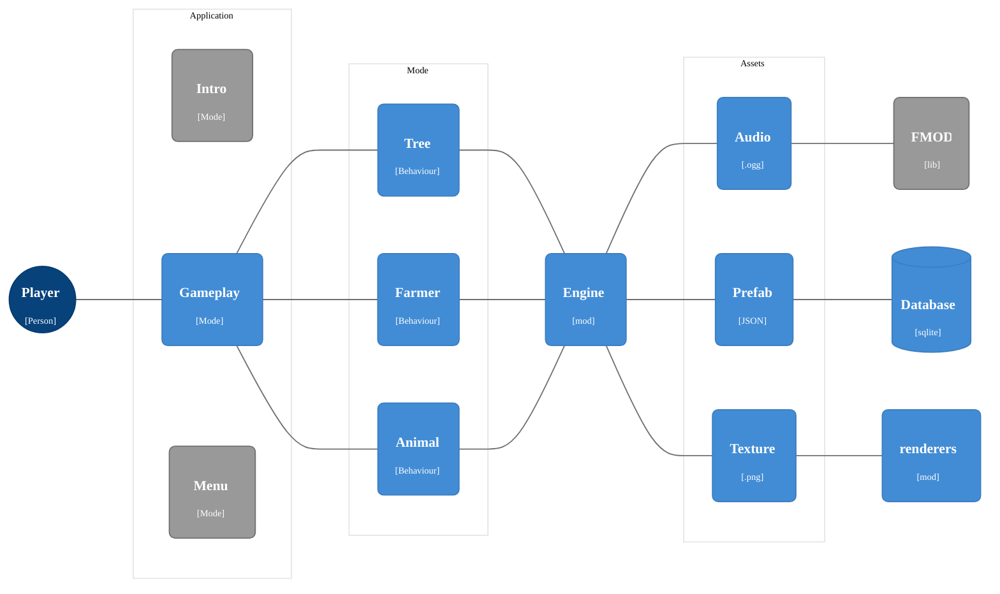

# Client

```mermaid
%%{init: {'theme': 'base', 'themeVariables': {
  'primaryColor': '#428cd5',
  'primaryBorderColor': '#3d7ec0',
  'secondaryColor': 'white',
  'tertiaryColor': 'white',
  'lineColor': '#707070',
  'primaryTextColor': '#707070',
  'tertiaryTextColor': 'black',
  'textColor': '#707070',
  'background': 'white',
  'fontSize': '8px',
  'fontFamily': 'ui-monospace,SFMono-Regular,SF Mono,Menlo,Consolas,Liberation Mono,monospace'
  }}
}%%
flowchart LR

	player(("<h2>&nbspPlayer&nbsp</h2>[Person]")):::person
	
	intro("<h2>&nbsp Intro &nbsp</h2>[Mode]"):::external
	gameplay("<h2>Gameplay</h2>[Mode]"):::component
	menu("<h2>&nbsp Menu &nbsp</h2>[Mode]"):::external
	
	tree("<h2>Tree</h2>[Behaviour]"):::component
	farmer("<h2>Farmer</h2>[Behaviour]"):::component
	animal("<h2>Animal</h2>[Behaviour]"):::component
	
	engine("<h2>Engine</h2>[mod]"):::component
	
	audio("<h2>Audio</h2>[.ogg]"):::component
	model("<h2>Prefab</h2>[JSON]"):::component
	texture("<h2>Texture</h2>[.png]"):::component
	
	fmod("<h2>FMOD</h2>[lib]"):::external
	renderers[("<h2>Database</h2>[sqlite]")]:::component
	bumaga("<h2>renderers</h2>[mod]"):::component
	
	
	
	subgraph mode[Application]
		intro
		gameplay
		menu
	end
	
	
	
	subgraph gp[Mode]
		tree
		farmer
		animal
	end
	
	subgraph assets[Assets]
		audio
		model
		texture
	end
	
	player --- gameplay --- tree & farmer & animal --- engine --- audio & model & texture
	
	audio --- fmod
	model --- renderers
	texture --- bumaga
	

	classDef person fill:#07427b,stroke:#073b6f,color:white
	classDef component color:white
	classDef external fill:#999999,stroke:#707070,color:white

```