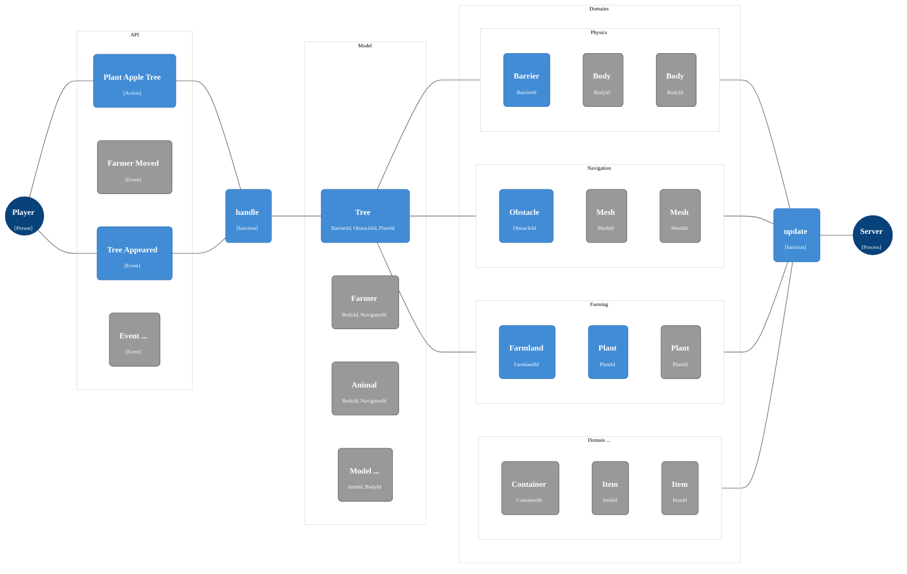

# Game

Module handles mechanics, provides game model and API for interaction.

```mermaid
%%{init: {'theme': 'base', 'themeVariables': {
  'primaryColor': '#428cd5',
  'primaryBorderColor': '#3d7ec0',
  'secondaryColor': 'white',
  'tertiaryColor': 'white',
  'lineColor': '#707070',
  'primaryTextColor': '#707070',
  'tertiaryTextColor': 'black',
  'textColor': '#707070',
  'background': 'white',
  'fontSize': '8px',
  'fontFamily': 'ui-monospace,SFMono-Regular,SF Mono,Menlo,Consolas,Liberation Mono,monospace'
  }}
}%%
flowchart LR

	player(("<h2>&nbspPlayer&nbsp</h2>[Person]")):::person
	server(("<h2>&nbspServer&nbsp</h2>[Process]")):::person
	action("<h2>Plant Apple Tree</h2>[Action]"):::component
	event1("<h2>Farmer Moved</h2>[Event]"):::external
	event2("<h2>Tree Appeared</h2>[Event]"):::component
	event3("<h2>Event ...</h2>[Event]"):::external
	universe("<h2>handle</h2>[function]"):::component
	
	tree("<h2>&nbspTree&nbsp</h2>BarrierId, ObstacleId, PlantId"):::component
	farmer("<h2>Farmer</h2>BodyId, NavigatorId"):::external
	animal("<h2>Animal</h2>BodyId, NavigatorId"):::external
	othermodel("<h2>Model ...</h2>ItemId, BodyId"):::external
	
	barrier("<h2>Barrier</h2>BarrierId"):::component
	body1("<h2>Body</h2>BodyId"):::external
	body2("<h2>Body</h2>BodyId"):::external
	
	obstacle("<h2>Obstacle</h2>ObstacleId"):::component
	navigator1("<h2>Mesh</h2>MeshId"):::external
	navigator2("<h2>Mesh</h2>MeshId"):::external
	
	plant("<h2>Farmland</h2>FarmlandId"):::component
	plant1("<h2>Plant</h2>PlantId"):::component
	plant2("<h2>Plant</h2>PlantId"):::external
	
	item("<h2>Container</h2>ContainerId"):::external
	item1("<h2>Item</h2>ItemId"):::external
	item2("<h2>Item</h2>ItemId"):::external
	
	update("<h2>update</h2>[function]"):::component
	
	player --- action & event2
	
	action & event2 --- universe
	
	universe --- tree
	
	tree --- physics & navigation & farming
	
	subgraph api[API]
		action
		event1
		event2
		event3
	end
	
	subgraph model[Model]
	
		farmer
		tree
		animal
		othermodel
	end
	
	subgraph physics[Physics]
		barrier
		body1
		body2
	end
	
	subgraph navigation[Navigation]
		obstacle
		navigator1
		navigator2
	end
	
	subgraph farming[Farming]
		plant
		plant1
		plant2
	end
	
	subgraph inventory[Domain ...]
		item
		item1
		item2
	end
	
	subgraph domains[Domains]
	        physics
		navigation
		farming 
		inventory
	end
	physics & navigation & farming & inventory --- update --- server

	classDef person fill:#07427b,stroke:#073b6f,color:white
	classDef component color:white
	classDef external fill:#999999,stroke:#707070,color:white

```