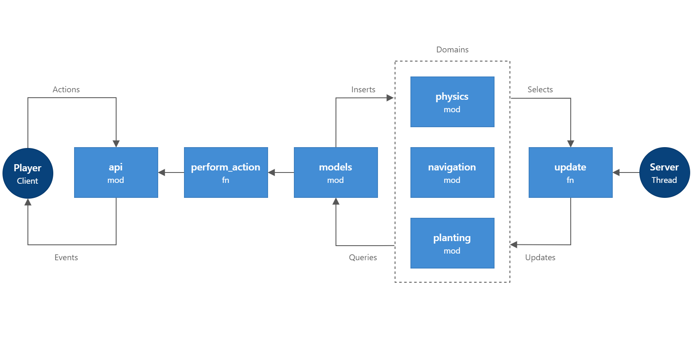

# Game

Game is heart of the project. Module handles mechanics, 
provides game model and API for interaction.
Designed as server side of client-server architecture
to serve local and remote players on host computer.

## Architecture

The fundamental idea is that instead of processing just the current state of the game,
use push-only sequence of events to describe all changes to the game state.

The event sequence acts as log and can be used to materialize views of the game objects.
This leads to a number of features:

*   Flexibility. The game server publish these events so that player client can be notified and
    can handle the game state changes if needed. Client known about the type of event and
    event data, but decoupled from server runtime. In addition, multiple consumer can handle each event.
    This enables easy development and integration with other sub-systems of the game: AI, UI, animation, graphics, etc.

*   Performance. The action that initiated an event can continue,
    and clients that handle the events can run in the background.
    This can vastly improve performance and respond time of the game server.

*   Responsive AI. The continual evaluating of transition conditions
    of AI decision making engine can be expensive and evaluating all game state
    can be challenging. Rather than evaluating everything,
    it makes more sense to provide game events, so that the AI
    can make complex decisions when these events occur.

## Domains

It is the bounds within which certain game processes are implemented
and certain rules/actions are applied. In fact, each domain is unique game mechanic.
Domains are independent Rust modules.

*   [Physics](src/domains/physics)

    Provides an real-time simulation of rigid body dynamics including collision detection.
    This domain is the foundation to organize game world in bounded areas for performance optimization
    and implementation of related algorithms.

*   Navigation

    Navigation domain addresses the problem of finding a path from the starting point to the destination,
    avoiding obstacles and optimizing costs (time, distance, equipment, etc).
    By using both pathfinding and movement algorithms of physics domain
    we're trying to achieve best result of task to move game entity to destination.

*   [Planting](src/domains/planting)

    Planting domain associated with planting, growing, and harvesting plants on the farm.
    It's one of the main income sources for the game, and provides most of the ingredients
    for character life support process.

*   [Building](src/domains/building)

    Building ...

*   [Inventory](src/domains/inventory)

    While playing game, player will acquire a good many items. Some will be looted from fallen enemies.
    Some will be purchased from a merchant or crafted.
    Inventory domain represents these items, solves management and storage problems.
